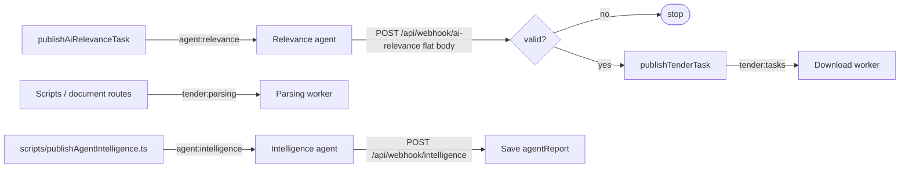
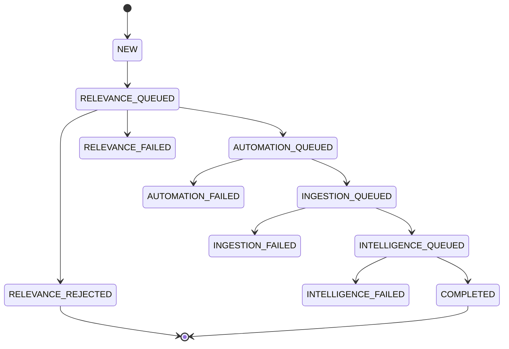

# Tender Lifecycle

> **Source of truth** for how a tender moves through the AI and automation pipeline.
> Any change to queues, payloads, webhooks, client IDs or statuses must update this file **and**
> [`lib/tender-lifecycle.ts`](../lib/tender-lifecycle.ts) / [`lib/queue/config.ts`](../lib/queue/config.ts) in the same change.
>
> Last updated: 2026-10-03

## Contents

1. [Overview](#1-overview)
2. [Pipeline versions (v1 vs v2)](#2-pipeline-versions-v1-vs-v2)
3. [v2 lifecycle (target)](#3-v2-lifecycle-target)
4. [v2 stage details](#4-v2-stage-details)
5. [v1 lifecycle (legacy)](#5-v1-lifecycle-legacy)
6. [Lifecycle status](#6-lifecycle-status)
7. [Client IDs](#7-client-ids)
8. [Webhook envelope](#8-webhook-envelope)
9. [Conventions](#9-conventions)
10. [Implementation gaps](#10-implementation-gaps)

---

## 1. Overview

A tender passes through five asynchronous stages. The dashboard publishes a job to a RabbitMQ queue, a worker
processes it, and the worker calls back a dashboard webhook. The webhook saves the result and publishes the job
for the next stage.

After automation the pipeline branches. Parsing and ingestion run in parallel. Parsing is a side branch: it stores
a result per file and publishes nothing. The main chain continues ingestion → intelligence → completed.

```
AI relevance ──(valid = yes)──► Automation ──┬──► Parsing (per file, side branch, ends at TenderFile.parseResult)
      │                                      │
      │                                      └──► Ingestion ──► Intelligence ──► Completed
      │
      └──(valid = no)──► Rejected (stop)
```

## 2. Pipeline versions (v1 vs v2)

| Aspect | v1 (legacy) | v2 (target) |
|---|---|---|
| Automation queue | `tender:tasks` | `automation-v2:tasks` |
| Parsing queue | `tender:parsing` | `automation-v2:parsing` |
| Ingestion stage | none | `agent:ingestion` |
| Client ID in payload | **yes** (attached by publishers, both versions) | **yes** |
| Worker callback format | flat JSON per webhook | shared envelope ([§8](#8-webhook-envelope)) |
| Stage handoff | partly manual (scripts, UI actions) | each webhook publishes the next stage; automation publishes parsing and ingestion in parallel |
| Selected by | `AUTOMATION_VERSION=v1` | `AUTOMATION_VERSION=v2` |

All tender task and parsing publishes (lifecycle, scripts, document routes, costing/CVA parsing) go to the queues of
the version selected by `AUTOMATION_VERSION`. Both sets stay in `QUEUES`.

### Version switch: `AUTOMATION_VERSION`

Required env var. Values: `v1` or `v2`. It selects the automation queues through `automationQueues()`
(`lib/queue/config.ts`).

| `AUTOMATION_VERSION` | Download queue | Parsing queue |
|---|---|---|
| `v1` | `tender:tasks` | `tender:parsing` |
| `v2` | `automation-v2:tasks` | `automation-v2:parsing` |

- Applies to **every** tender task and parsing publisher: `publishTenderTask`, `publishTenderParsingTask`
  (`COSTING_ATTACHMENT_PARSING`), `publishGemPdfParsingTask`, `publishNonGemBoqParsingTask` and
  `publishTenderFileParsingTask`. This includes scripts and costing/CVA parsing.
- Does not apply to agent queues (`agent:relevance`, `agent:ingestion`, `agent:intelligence`). They have one version.
- If the value is missing or invalid, these publishers throw `AUTOMATION_VERSION must be "v1" or "v2"`. Nothing is published.
- Payloads do not change with the version. Workers must accept `client_id` on both versions.
- Switching the version does not move jobs already in a queue. Drain the old queues before you switch.

## 3. v2 lifecycle (target)

```mermaid
flowchart LR
    START([Tender synced]) --> PR[Publish relevance]
    PR -->|agent:relevance| W1[Relevance agent]
    W1 -->|POST /api/webhook/ai-relevance| H1{valid?}
    H1 -->|no| REJ([RELEVANCE_REJECTED])
    H1 -->|yes| Q2[Publish automation]
    Q2 -->|automation-v2:tasks| W2[Automation worker]
    W2 -->|POST /api/webhook/automation| H2[Save TenderFile rows]
    H2 -->|automation-v2:parsing, one job per candidate file| W3[Parsing worker]
    W3 -->|POST /api/webhook/parsing| H3([Save parse result on TenderFile])
    H2 -->|agent:ingestion, one job per event| W4[Ingestion agent]
    W4 -->|POST /api/webhook/ingestion| H4[Ingestion done]
    H4 -->|agent:intelligence| W5[Intelligence agent]
    W5 -->|POST /api/webhook/intelligence| H5[Save agentReport]
    H5 --> DONE([COMPLETED])
```



### Stage summary

| # | Stage | Queue | Client ID env (sent in payload) | Webhook that receives the result | Webhook publishes next to |
|---|---|---|---|---|---|
| 1 | Relevance | `agent:relevance` | `TENDER_AGENT_RELEVANCE_CLIENT_ID` | `/api/webhook/ai-relevance` | `automation-v2:tasks` if `valid = true`, else stop |
| 2 | Automation | `automation-v2:tasks` | `TENDER_AUTOMATION_AUTOMATION_CLIENT_ID` | `/api/webhook/automation` | `automation-v2:parsing` (one job per candidate file) **and** `agent:ingestion` (one job) |
| 3 | Parsing (branch) | `automation-v2:parsing` | `TENDER_AUTOMATION_PARSING_CLIENT_ID` | `/api/webhook/parsing` | none (branch ends) |
| 4 | Ingestion | `agent:ingestion` | `TENDER_AGENT_INGESTION_CLIENT_ID` | `/api/webhook/ingestion` | `agent:intelligence` |
| 5 | Intelligence | `agent:intelligence` | `TENDER_AGENT_INTELLIGENCE_CLIENT_ID` | `/api/webhook/intelligence` | none (terminal) |

Rule: **the client ID for a stage is read from env and attached by whoever publishes to that stage's queue**,
which is the webhook of the previous stage (or the trigger, for relevance). Parsing and ingestion are both
published by `/api/webhook/automation`.

## 4. v2 stage details

### Stage 1 — AI relevance

| | |
|---|---|
| Trigger | `publishAiAnalysisJob` in `actions/ai-analysis.ts` (server action, `withLog`) |
| Publisher | `publishAiRelevanceTask` (`lib/queue/publisher.ts`) |
| Queue | `agent:relevance` (`QUEUES.AGENT_RELEVANCE`) |
| Client ID | `TENDER_AGENT_RELEVANCE_CLIENT_ID` |
| Status on publish | `RELEVANCE_QUEUED` |

Payload:

```json
{
  "payloadType": "analysis",
  "referenceNo": "GEM/2026/B/1234567",
  "company": "laser",
  "tenderbrief": "...",
  "itemcategory": "...",
  "client_id": "<TENDER_AGENT_RELEVANCE_CLIENT_ID>"
}
```

Webhook `POST /api/webhook/ai-relevance`:

- Result fields: `valid` (boolean), `reason` (string), `company` (`laser` | `gmd`).
- DB write: `TenderMerged.aiRelevanceValid`, `TenderMerged.aiRelevanceReason`.
- `valid = false`: status `RELEVANCE_REJECTED`. Pipeline stops.
- `valid = true`: publish stage 2, status `AUTOMATION_QUEUED`.
- Worker error: status `RELEVANCE_FAILED`.

### Stage 2 — Automation (file fetch)

| | |
|---|---|
| Trigger | `/api/webhook/ai-relevance` when `valid = true` |
| Queue | `automation-v2:tasks` (`QUEUES.AUTOMATION_V2_TASKS`) |
| Client ID | `TENDER_AUTOMATION_AUTOMATION_CLIENT_ID` |
| Status on publish | `AUTOMATION_QUEUED` |

Payload (`type` by `TenderMerged.tenderType`):

```json
{
  "type": "GEM_DOWNLOAD",
  "tenderId": 123,
  "referenceNo": "GEM/2026/B/1234567",
  "gemId": "GEM/2026/B/1234567",
  "timestamp": 1790000000000,
  "client_id": "<TENDER_AUTOMATION_AUTOMATION_CLIENT_ID>"
}
```

`type` values: `GEM_DOWNLOAD`, `RA_GEM_DOWNLOAD`, `NON_GEM_DOWNLOAD`. `gemId` only for GeM types.

Webhook `POST /api/webhook/automation` (envelope, [§8](#8-webhook-envelope)):

- Success event: `file.fetched_success`. Other events are logged only.
- `data.result.files[]`: `{ name, extension, url, tag, source }`. The file name overrides `tag` (case-insensitive): contains `boq` → `boqComparativeChart`, contains `costing` → `costingAttachment`. Otherwise the worker's `tag` is kept and must be a value of `TENDER_FILE_TYPES` (`lib/tender-file-types.ts`), else `400`.
- `TENDER_AUTOMATION_PARSING_CLIENT_ID` and `TENDER_AGENT_INGESTION_CLIENT_ID` are checked before anything is saved.
- DB write: one `TenderFile` row per new URL. URLs already stored are skipped (retry-safe).
- Parsing branch: only candidate files get `parseStatus = PENDING` and a stage 3 job. Candidates by `data.type`:
  `GEM_DOWNLOAD` / `RA_GEM_DOWNLOAD` → tag `tenderDocument`; `NON_GEM_DOWNLOAD` → tag `boqComparativeChart`.
  Other files keep `parseStatus = null`. If a parsing job is not published, that file is set to
  `parseStatus = FAILED` (`parseError = "Parsing job not queued"`).
- Ingestion: if the event saved at least one new file, publish stage 4 once with all `TenderFile` rows of the
  tender, status `INGESTION_QUEUED`. It does not wait for parsing. A retry that saves no new file publishes nothing.
- Worker error: status `AUTOMATION_FAILED`.

Parsing type mapping:

| Automation `data.type` | Parsing `type` | File tag sent for parsing |
|---|---|---|
| `GEM_DOWNLOAD` | `GEM_PDF_PARSING` | `tenderDocument` |
| `RA_GEM_DOWNLOAD` | `RA_GEM_PDF_PARSING` | `tenderDocument` |
| `NON_GEM_DOWNLOAD` | `NON_GEM_BOQ_PARSING` | `boqComparativeChart` |

### Stage 3 — Parsing

| | |
|---|---|
| Trigger | `/api/webhook/automation` (candidate files only) |
| Publisher | `publishTenderFileParsingTask` (`lib/queue/publisher.ts`) |
| Queue | `automation-v2:parsing` (`QUEUES.AUTOMATION_V2_PARSING`) |
| Client ID | `TENDER_AUTOMATION_PARSING_CLIENT_ID` |
| Status on publish | `TenderFile.parseStatus = PENDING` (per file, not tender status) |

Payload:

```json
{
  "type": "GEM_PDF_PARSING",
  "referenceNo": "GEM/2026/B/1234567",
  "file_link": "https://...",
  "client_id": "<TENDER_AUTOMATION_PARSING_CLIENT_ID>"
}
```

Webhook `POST /api/webhook/parsing` (envelope):

- Events: `file.parsed_success`, `file.parsed_failed`. Other events are logged only.
- `data.file_link` is **required**. The worker echoes the `file_link` of the job. It identifies the `TenderFile`
  (`tenderMergedId` + `url`). Missing: `400`.
- Success: `TenderFile.parseStatus = COMPLETED`, `parseResult = data.result` (JSON, shape by parsing type).
- Failure (`file.parsed_failed` or non-null `data.error`): `parseStatus = FAILED`, `parseError = data.error`.
- Only a `PENDING` file is updated. A retried event for a settled file is a no-op (`handled: false`).
- Nothing is published. Parsing is a side branch and does not gate ingestion or intelligence.

`TenderFile.parseStatus` values: `null` (never sent for parsing), `PENDING`, `COMPLETED`, `FAILED`.

### Stage 4 — Ingestion

| | |
|---|---|
| Trigger | `/api/webhook/automation` (in parallel with parsing) |
| Publisher | `publishIngestionTask` (`lib/queue/publisher.ts`) |
| Queue | `agent:ingestion` (`QUEUES.AGENT_INGESTION`) |
| Client ID | `TENDER_AGENT_INGESTION_CLIENT_ID` |
| Status on publish | `INGESTION_QUEUED` |

Payload:

```json
{
  "referenceNo": "GEM/2026/B/1234567",
  "files": [
    {
      "id": 1,
      "name": "bid.pdf",
      "extension": "pdf",
      "url": "https://...",
      "source": "gem",
      "tags": ["tenderDocument"]
    }
  ],
  "client_id": "<TENDER_AGENT_INGESTION_CLIENT_ID>"
}
```

`files` holds file metadata only. Parse results are not included, because parsing may still be running.

Webhook `POST /api/webhook/ingestion` (envelope):

- Success: event ending in `_success` and `data.error` null. Other events are logged only.
- Nothing is stored. Publishes stage 5 with `tenderBrief` / `itemCategory` from `TenderMerged` (`company = laser`),
  status `INTELLIGENCE_QUEUED`.
- Worker error: status `INGESTION_FAILED`.

### Stage 5 — Intelligence

| | |
|---|---|
| Trigger | `/api/webhook/ingestion` |
| Publisher | `publishAgentIntelligenceTask` (`lib/queue/publisher.ts`) |
| Queue | `agent:intelligence` (`QUEUES.AGENT_INTELLIGENCE`) |
| Client ID | `TENDER_AGENT_INTELLIGENCE_CLIENT_ID` |
| Status on publish | `INTELLIGENCE_QUEUED` |

Payload:

```json
{
  "payloadType": "analysis",
  "referenceNo": "GEM/2026/B/1234567",
  "company": "laser",
  "tenderbrief": "...",
  "itemcategory": "...",
  "client_id": "<TENDER_AGENT_INTELLIGENCE_CLIENT_ID>"
}
```

Webhook `POST /api/webhook/intelligence` (accepts `POST` and `PATCH`, envelope or flat body):

- Report: `agentReport` (string, JSON string, or object with `tender_id` + `sections`), or a report object
  sent directly as the body.
- Objects are converted with `agentReportToMarkdown` (`lib/agent-report-markdown.ts`).
- DB write: `TenderMerged.agentReport`.
- Status `COMPLETED`. Terminal stage, nothing published.
- Worker error: status `INTELLIGENCE_FAILED`.

## 5. v1 lifecycle (legacy)

v1 is the pipeline the code ran before automation v2. It is still used by scripts and some UI actions.



| Stage | Queue | Publisher | Payload notes | Result path |
|---|---|---|---|---|
| Relevance | `agent:relevance` | `publishAiRelevanceTask` | `client_id` attached by publisher | `/api/webhook/ai-relevance`, flat `{ referenceNo, company, valid, reason }` |
| Download | `tender:tasks` | `publishTenderTask` | `TenderTaskPayload`: `GEM_DOWNLOAD` / `NON_GEM_DOWNLOAD`, `client_id` attached by publisher | no webhook; worker writes DB directly |
| Parsing | `tender:parsing` | `publishGemPdfParsingTask`, `publishNonGemBoqParsingTask`, `publishTenderParsingTask` (`COSTING_ATTACHMENT_PARSING`) | `client_id` attached by publisher | no webhook; worker writes DB (e.g. `parse_status`) |
| Ingestion | none | none | none | none |
| Intelligence | `agent:intelligence` | `publishAgentIntelligenceTask`, `scripts/publishAgentIntelligence.ts` | `client_id` attached by publisher (the script adds it itself) | `/api/webhook/intelligence` (formerly `/api/webhook/agent-report`) |

v1 handoffs after relevance are not chained. Parsing and intelligence start from scripts
(`scripts/publishTenders.ts`, `scripts/publishParsingJobs.ts`, `scripts/publishAgentIntelligence.ts`) or UI routes
(`app/api/executive-tenders/[tenderId]/document/route.ts`, `app/api/parse-cva/route.ts`).

Costing attachment / CVA parsing (`COSTING_ATTACHMENT_PARSING`) is not part of the tender lifecycle, but its
queue follows `AUTOMATION_VERSION` like every other tender parsing job.

## 6. Lifecycle status

Defined in [`lib/tender-lifecycle.ts`](../lib/tender-lifecycle.ts) as `TENDER_LIFECYCLE_STATUS`.
Not persisted yet. It needs a column on `TenderMerged` (database migration run by the team, not by tooling).

| Status | Meaning | Set by |
|---|---|---|
| `NEW` | Tender exists, nothing published | default |
| `RELEVANCE_QUEUED` | Job on `agent:relevance` | relevance trigger |
| `RELEVANCE_REJECTED` | Agent returned `valid = false`. Terminal. | `/api/webhook/ai-relevance` |
| `RELEVANCE_FAILED` | Agent error or publish failure | relevance trigger / webhook |
| `AUTOMATION_QUEUED` | Job on `automation-v2:tasks` | `/api/webhook/ai-relevance` |
| `AUTOMATION_FAILED` | File fetch error or publish failure | `/api/webhook/automation` / `/api/webhook/ai-relevance` |
| `INGESTION_QUEUED` | Job on `agent:ingestion` | `/api/webhook/automation` |
| `INGESTION_FAILED` | Ingestion error or publish failure | `/api/webhook/ingestion` / `/api/webhook/automation` |
| `INTELLIGENCE_QUEUED` | Job on `agent:intelligence` | `/api/webhook/ingestion` |
| `INTELLIGENCE_FAILED` | Intelligence error or publish failure | `/api/webhook/intelligence` / `/api/webhook/ingestion` |
| `COMPLETED` | `agentReport` saved. Terminal. | `/api/webhook/intelligence` |

Rules:

- Tender status follows the main chain only. Parsing has no tender status; it is tracked per file in
  `TenderFile.parseStatus` (`null`, `PENDING`, `COMPLETED`, `FAILED`).
- No separate `*_DONE` status. A stage is done when the next stage is `*_QUEUED`.
- A publish failure sets the **next** stage to `*_FAILED`, because that stage never received its job.
- A worker error event sets the **current** stage to `*_FAILED`.
- Status only moves forward, except a manual retry, which resets to the retried stage's `*_QUEUED`.



## 7. Client IDs

All are required. They are listed in `.env.example` and typed in `types/env.d.ts`.

| Env var | Sent to queue | Attached by |
|---|---|---|
| `TENDER_AGENT_RELEVANCE_CLIENT_ID` | `agent:relevance` | relevance trigger (`actions/ai-analysis.ts`) |
| `TENDER_AUTOMATION_AUTOMATION_CLIENT_ID` | `automation-v2:tasks` | `/api/webhook/ai-relevance` |
| `TENDER_AUTOMATION_PARSING_CLIENT_ID` | `automation-v2:parsing` | `/api/webhook/automation` |
| `TENDER_AGENT_INGESTION_CLIENT_ID` | `agent:ingestion` | `/api/webhook/automation` |
| `TENDER_AGENT_INTELLIGENCE_CLIENT_ID` | `agent:intelligence` | `/api/webhook/ingestion` |
| `TENDER_AGENT_FEEDBACK_CLIENT_ID` | feedback agent | outside the main lifecycle |

Rules:

- Publishers in `lib/queue/publisher.ts` attach `client_id` themselves through `withClientId`. Callers never pass it.
- If the env var is missing, `requireClientId` throws an error with status 500 (`"<VAR> is not set"`) and nothing is published.
- A webhook that saves data before publishing must call `requireClientId` for the next stage **before** it saves.
  Reason: retries skip rows already saved, so their jobs would never be published.
  Reference: `app/api/webhook/automation/route.ts`.

| Publisher | Client ID attached |
|---|---|
| `publishAiRelevanceTask` | `TENDER_AGENT_RELEVANCE_CLIENT_ID` |
| `publishTenderTask` | `TENDER_AUTOMATION_AUTOMATION_CLIENT_ID` |
| `publishTenderParsingTask`, `publishGemPdfParsingTask`, `publishNonGemBoqParsingTask`, `publishTenderFileParsingTask` | `TENDER_AUTOMATION_PARSING_CLIENT_ID` |
| `publishIngestionTask` | `TENDER_AGENT_INGESTION_CLIENT_ID` |
| `publishAgentIntelligenceTask` | `TENDER_AGENT_INTELLIGENCE_CLIENT_ID` |

## 8. Webhook envelope

All v2 workers call back with this body. Parsed and validated by `createWebhookHandler` (`lib/webhook-event.ts`).

```json
{
  "id": "evt_01J...",
  "event": "file.fetched_success",
  "created_at": "2026-10-02T10:00:00Z",
  "data": {
    "type": "GEM_DOWNLOAD",
    "referenceNo": "GEM/2026/B/1234567",
    "result": {},
    "error": null
  }
}
```

| Field | Required | Notes |
|---|---|---|
| `id` | yes | Unique event ID. Logged. |
| `event` | yes | Event name, e.g. `file.fetched_success` |
| `created_at` | no | ISO timestamp |
| `data.type` | yes | Job type that produced the event |
| `data.referenceNo` | yes | `TenderMerged.referenceNo` |
| `data.result` | no | Stage-specific result |
| `data.error` | no | Non-null means failure. The handler logs it and sets `*_FAILED`. |

Validation errors return `400`. An unknown `referenceNo` returns `404`.

## 9. Conventions

- Wrap every webhook and server action in `withLog` (`lib/activity-logger.ts`). Webhooks log the actor as
  `<Source> Agent` with `userId: null`.
- Add every webhook path to `publicApiPaths` in `proxy.ts`.
- Make webhooks idempotent. Workers retry, so a repeated event must not duplicate rows or jobs.
- A publish failure must not fail the webhook. The stage result is already saved. Log a warning and set the status.
- Queue names live only in `QUEUES` (`lib/queue/config.ts`). Do not hardcode them.
- Publishers live only in `lib/queue/publisher.ts`.

## 10. Implementation gaps

State of the code on 2026-10-03 compared with v2. Tick each item when done.

- [x] `publishAiRelevanceTask` attaches `TENDER_AGENT_RELEVANCE_CLIENT_ID`.
- [ ] `/api/webhook/ai-relevance` uses a flat body, not the envelope.
- [x] `/api/webhook/ai-relevance` download job carries `TENDER_AUTOMATION_AUTOMATION_CLIENT_ID` (attached by `publishTenderTask`).
- [x] All parsing publishers attach `TENDER_AUTOMATION_PARSING_CLIENT_ID`.
- [x] Download and parsing publishers pick v1 or v2 queues from `AUTOMATION_VERSION`.
- [x] `/api/webhook/parsing` saves the result on `TenderFile`. It publishes nothing (side branch).
- [x] `/api/webhook/automation` publishes parsing and ingestion in parallel.
- [x] `publishIngestionTask` and `/api/webhook/ingestion` added.
- [ ] `/api/webhook/intelligence` does not use `createWebhookHandler` and does not check `client_id`.
- [x] `publishAgentIntelligenceTask` attaches `TENDER_AGENT_INTELLIGENCE_CLIENT_ID`.
- [ ] `TENDER_LIFECYCLE_STATUS` is not persisted. It needs a `TenderMerged` column (migration run by the team).
- [ ] Parsing worker must echo `file_link` in `data` (`automation_v2/dispatch.py`).
- [x] Queue constants `AUTOMATION_V2_TASKS`, `AUTOMATION_V2_PARSING`, `AGENT_INGESTION` added to `QUEUES`.
- [x] `/api/webhook/agent-report` renamed to `/api/webhook/intelligence`.
